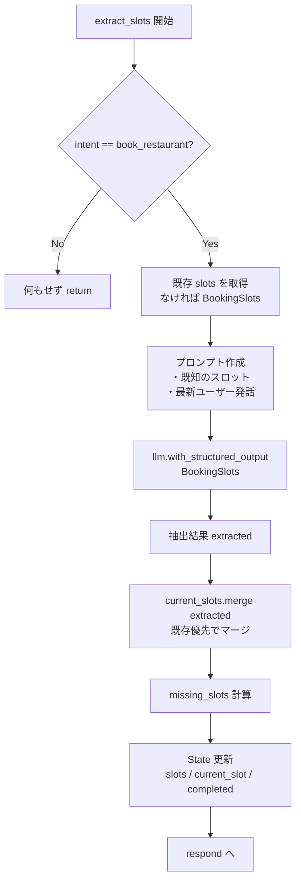

```mermaid
flowchart TD
    StartExtract[extract_slots 開始] --> CheckIntent2{intent == book_restaurant?}
    CheckIntent2 -->|No| Skip[何もせず return]
    CheckIntent2 -->|Yes| LoadSlots[既存 slots を取得<br/>なければ BookingSlots]

    LoadSlots --> BuildPrompt[プロンプト作成<br/>・既知のスロット<br/>・最新ユーザー発話]
    BuildPrompt --> Structured[llm.with_structured_output<br/>BookingSlots]
    Structured --> Extracted[抽出結果 extracted]
    Extracted --> Merge[current_slots.merge extracted<br/>既存優先でマージ]
    Merge --> Missing[missing_slots 計算]
    Missing --> UpdateState[State 更新<br/>slots / current_slot / completed]
    UpdateState --> ToRespond[respond へ]

```