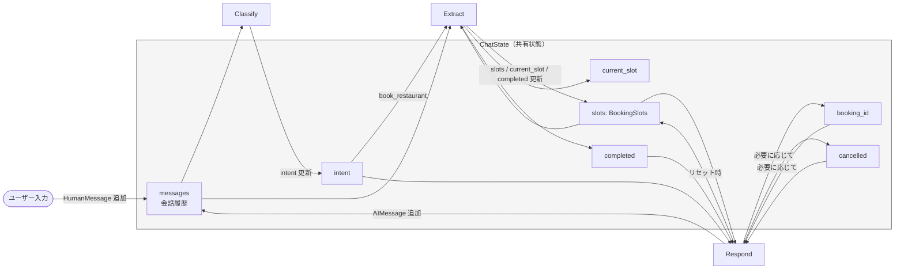

```mermaid
flowchart LR
    subgraph State["ChatState（共有状態）"]
        M[messages<br/>会話履歴]
        I[intent]
        S[slots: BookingSlots]
        C[current_slot]
        Comp[completed]
        BID[booking_id]
        Can[cancelled]
    end

    User([ユーザー入力]) -->|HumanMessage 追加| M

    M --> Classify
    Classify -->|intent 更新| I

    I -->|book_restaurant| Extract
    M --> Extract
    S --> Extract
    Extract -->|slots / current_slot / completed 更新| S
    Extract --> C
    Extract --> Comp

    I --> Respond
    S --> Respond
    Comp --> Respond
    BID --> Respond
    Can --> Respond

    Respond -->|AIMessage 追加| M
    Respond -->|必要に応じて| BID
    Respond -->|必要に応じて| Can
    Respond -->|リセット時| S

    style State fill:#f5f5f5,stroke:#333
```